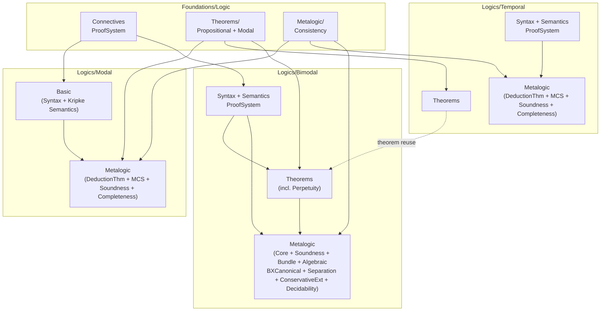

# Implementation Plan: Improve ROADMAP.md diagram and structure

- **Task**: 45 - Improve ROADMAP.md diagram and structure
- **Status**: [COMPLETED]
- **Effort**: 1 hour
- **Dependencies**: None
- **Research Inputs**: specs/045_improve_roadmap_diagram_and_structure/reports/01_roadmap-improvement.md
- **Artifacts**: plans/01_roadmap-improvement.md (this file)
- **Standards**: plan-format.md, status-markers.md, artifact-management.md, tasks.md
- **Type**: markdown
- **Lean Intent**: false

## Overview

Restructure `specs/ROADMAP.md` by replacing the inaccurate ASCII Import Hierarchy with a mermaid flowchart showing the actual five-layer module dependency graph, removing all task number references throughout the file, deleting the Phases section entirely, and adding a focused file tree showing the current `Cslib/Foundations/Logic/` and `Cslib/Logics/` directory structure. The result is a cleaner orientation document that directs readers to TODO.md for task tracking.

### Research Integration

The research report (01_roadmap-improvement.md) traced all import statements across `Cslib/Foundations/Logic/` and `Cslib/Logics/` to produce an accurate dependency graph. Key findings integrated:
- The current ASCII diagram omits the `Bimodal.Theorems.Perpetuity -> Temporal.Theorems` cross-import edge
- Five logical layers confirmed: Foundations -> Modal (parallel) / Temporal (parallel) -> Bimodal
- Bimodal does NOT import from Modal or Temporal metalogic -- only from `Temporal.Theorems`
- Task references appear in: intro paragraph, Import Hierarchy labels, Completed table, Remaining table, and Phases section
- The file tree should be scoped to `Cslib/Foundations/Logic/` and `Cslib/Logics/` only (not Computability, Crypto, etc.)

### Prior Plan Reference

No prior plan.

### Roadmap Alignment

This task directly improves the ROADMAP.md document itself. No roadmap items to advance.

## Goals & Non-Goals

**Goals**:
- Replace ASCII Import Hierarchy with an accurate mermaid flowchart diagram
- Remove all task number references (Task N, Tasks N-M, etc.) from every section
- Remove the entire Phases section
- Add a file tree section showing current logic library structure
- Ensure the document reads as a coherent orientation guide after changes

**Non-Goals**:
- Changing the content or meaning of the Approach section
- Adding new roadmap items or changing completion status of items
- Modifying any files other than `specs/ROADMAP.md`
- Showing non-logic modules (Computability, Crypto, etc.) in the file tree

## Risks & Mitigations

| Risk | Impact | Likelihood | Mitigation |
|------|--------|------------|------------|
| Mermaid diagram renders poorly on some viewers | M | L | Use standard mermaid flowchart syntax; keep nodes to subsystem granularity (not file-level) |
| Removing Task column from tables loses useful cross-reference | L | L | Readers directed to TODO.md; Component and Module columns are the primary information |
| File tree becomes stale as new files are added | L | M | Tree shows current state; note it represents a snapshot |

## Implementation Phases

**Dependency Analysis**:
| Wave | Phases | Blocked by |
|------|--------|------------|
| 1 | 1 | -- |
| 2 | 2 | 1 |
| 3 | 3 | 2 |
| 4 | 4 | 3 |

Phases are sequential because each modifies `specs/ROADMAP.md` and the document must remain coherent after each step.

### Phase 1: Replace Import Hierarchy with Mermaid Diagram [COMPLETED]

**Goal**: Replace the ASCII art Import Hierarchy section (lines 18-35 of current ROADMAP.md) with an accurately labeled mermaid flowchart showing the five-layer module dependency structure.

**Tasks**:
- [ ] Delete the entire current `## Import Hierarchy` section (the heading, ASCII art block, and the explanatory paragraph below it)
- [ ] Insert a new `## Module Dependency Structure` section in the same location with the following mermaid diagram:

````markdown
## Module Dependency Structure



Imports flow downward: Foundations at top, Modal and Temporal in the middle (independent of each other), Bimodal at the bottom. The dashed edge from Temporal Theorems to Bimodal Theorems represents the only cross-logic import (`Bimodal.Theorems.Perpetuity.Principles` imports `Temporal.Theorems.TemporalDerived`).
````

- [ ] Verify the section heading, mermaid block, and explanatory paragraph are well-formed

**Timing**: 15 minutes

**Depends on**: none

**Files to modify**:
- `specs/ROADMAP.md` - Replace lines 18-35 (Import Hierarchy section) with mermaid diagram section

**Verification**:
- The old ASCII art block and its task-number labels are gone
- The new mermaid block is valid (contains `flowchart TD`, proper subgraph syntax, correct edge list)
- The dashed edge `TT -.->|theorem reuse| BT` is present
- The explanatory paragraph below the diagram accurately describes the import flow

---

### Phase 2: Remove All Task References [COMPLETED]

**Goal**: Remove every task number reference from the entire file so readers use TODO.md for task tracking.

**Tasks**:
- [ ] **Intro paragraph**: Remove the sentence "Phases 1-3 (Propositional, Modal, Temporal) are complete, self-contained deliverables before any bimodal content is introduced." and rephrase the intro to orient readers by logical dependency layers rather than numbered phases. Suggested replacement for the full intro paragraph:

```markdown
This document describes the ongoing effort to extract and organize content from
the [BimodalLogic](https://github.com/benbrastmckie/BimodalLogic) repository
into four standalone CSLib modules: **Foundations/Logic**, **Modal**, **Temporal**,
and **Bimodal**. See `specs/TODO.md` for task tracking.
```

- [ ] **Completed table**: Remove the `Task` column entirely. Keep only `Component` and `Module` columns. The resulting table header becomes `| Component | Module |` with rows like `| Propositional Hilbert theorems (combinators, core, weakening, cut, big-conjunction) | Foundations/Logic/Theorems/ |`. Full replacement table:

```markdown
| Component | Module |
|-----------|--------|
| Propositional Hilbert theorems (combinators, core, weakening, cut, big-conjunction) | `Foundations/Logic/Theorems/` |
| Modal proof system, S4/S5 theorems, GeneralizedNecessitation | `Foundations/Logic/Theorems/Modal/` |
| Generic MCS foundations (SetConsistent, SetMaximalConsistent, Lindenbaum) | `Foundations/Logic/Metalogic/` |
| Temporal proof system (26-axiom BX), derived theorems, frame conditions | `Logics/Temporal/ProofSystem/` + `Logics/Temporal/Theorems/` |
| Temporal semantics on LinearOrder | `Logics/Temporal/Semantics/` |
| Modal metalogic: DeductionTheorem, MCS, Soundness, Completeness | `Logics/Modal/Metalogic/` |
| Bimodal syntax: Context, BigConj, Subformulas | `Logics/Bimodal/Syntax/` |
| Task frame semantics: TaskFrame, WorldHistory, Truth, Validity | `Logics/Bimodal/Semantics/` |
| Bimodal proof system: 42-axiom Hilbert, DerivationTree, Substitution | `Logics/Bimodal/ProofSystem/` |
| Perpetuity theorems (bimodal fixed-point principles) | `Logics/Bimodal/Theorems/Perpetuity/` |
| Frame conditions + Soundness | `Logics/Bimodal/FrameConditions/` + `Logics/Bimodal/Metalogic/Soundness/` |
| Bimodal DeductionTheorem + MCS theory | `Logics/Bimodal/Metalogic/Core/` |
| Base MCS completeness properties | `Logics/Bimodal/Metalogic/` |
| Separation theorem (GHR94 10.2.9) | `Logics/Bimodal/Metalogic/Separation/` |
| BX conservative extension | `Logics/Bimodal/Metalogic/ConservativeExtension/` |
| Tableau decision procedure | `Logics/Bimodal/Metalogic/Decidability/` |
| Finite model property | `Logics/Bimodal/Metalogic/Decidability/FMP/` |
```

- [ ] **Remaining table**: Remove the `Task` column entirely. Keep only `Component` and `Module` columns. Full replacement table:

```markdown
| Component | Module |
|-----------|--------|
| Temporal metalogic: DeductionTheorem, MCS, Soundness, Completeness | `Logics/Temporal/Metalogic/` |
| Dense completeness (Algebraic, Bundle, BXCanonical) | `Logics/Bimodal/Metalogic/` |
| Discrete completeness | `Logics/Bimodal/Metalogic/` |
| Continuous extension completeness | `Logics/Bimodal/Metalogic/` |
| Dense temporal completeness | `Logics/Temporal/Metalogic/` |
| Discrete temporal completeness | `Logics/Temporal/Metalogic/` |
| Continuous temporal completeness | `Logics/Temporal/Metalogic/` |
| Abstract shared completeness infrastructure | `Logics/Bimodal/Metalogic/` + `Logics/Temporal/Metalogic/` |
```

- [ ] Verify no remaining occurrences of "Task" followed by a number exist anywhere in the file (case-insensitive search for `[Tt]ask\s+\d`)

**Timing**: 20 minutes

**Depends on**: 1

**Files to modify**:
- `specs/ROADMAP.md` - Intro paragraph rewrite, Completed table column removal, Remaining table column removal

**Verification**:
- `grep -iE '[Tt]ask\s+[0-9]' specs/ROADMAP.md` returns no results
- `grep -i 'phase [0-9]' specs/ROADMAP.md` returns no results (after Phase 3 references removed from intro)
- Both tables have exactly 2 columns: Component and Module
- Intro paragraph mentions TODO.md for task tracking

---

### Phase 3: Remove Phases Section and Add File Tree [COMPLETED]

**Goal**: Delete the entire Phases section and add a new File Tree section showing the current logic library structure.

**Tasks**:
- [ ] Delete the entire `## Phases` section (from `## Phases` heading through the end of the file, approximately lines 72-102 in the current file)
- [ ] Add a new `## Project Structure` section after the Remaining table with the following file tree (showing only the logic-relevant subset of Cslib/):

````markdown
## Project Structure

The logic library lives in two directory trees within `Cslib/`:

```
Cslib/
├── Foundations/
│   └── Logic/
│       ├── Connectives.lean
│       ├── ProofSystem.lean
│       ├── InferenceSystem.lean
│       ├── LogicalEquivalence.lean
│       ├── Axioms.lean
│       ├── Theorems.lean
│       ├── Theorems/
│       │   ├── Propositional/
│       │   │   ├── Core.lean
│       │   │   ├── Connectives.lean
│       │   │   └── Reasoning.lean
│       │   ├── Modal/
│       │   │   ├── Basic.lean
│       │   │   └── S5.lean
│       │   ├── BigConj.lean
│       │   └── Combinators.lean
│       └── Metalogic/
│           └── Consistency.lean
└── Logics/
    ├── Modal/
    │   ├── Basic.lean
    │   ├── Cube.lean
    │   ├── Denotation.lean
    │   ├── Metalogic.lean
    │   └── Metalogic/
    │       ├── DerivationTree.lean
    │       ├── DeductionTheorem.lean
    │       ├── MCS.lean
    │       ├── Soundness.lean
    │       └── Completeness.lean
    ├── Temporal/
    │   ├── Syntax/
    │   │   ├── Formula.lean
    │   │   ├── Context.lean
    │   │   ├── BigConj.lean
    │   │   └── Subformulas.lean
    │   ├── Semantics/
    │   │   ├── Model.lean
    │   │   ├── Satisfies.lean
    │   │   └── Validity.lean
    │   ├── ProofSystem.lean
    │   ├── ProofSystem/
    │   │   ├── Axioms.lean
    │   │   ├── Derivation.lean
    │   │   ├── Derivable.lean
    │   │   └── Instances.lean
    │   ├── Theorems.lean
    │   ├── Theorems/
    │   │   ├── TemporalDerived.lean
    │   │   └── FrameConditions.lean
    │   ├── Metalogic.lean
    │   └── Metalogic/
    │       ├── DerivationTree.lean
    │       ├── DeductionTheorem.lean
    │       ├── MCS.lean
    │       ├── Soundness.lean
    │       └── Completeness.lean
    └── Bimodal/
        ├── Syntax/
        │   ├── Formula.lean
        │   ├── Context.lean
        │   ├── Subformulas.lean
        │   └── SubformulaClosure/
        ├── Semantics/
        │   ├── TaskFrame.lean
        │   ├── WorldHistory.lean
        │   ├── TaskModel.lean
        │   ├── Truth.lean
        │   └── Validity.lean
        ├── ProofSystem/
        │   ├── Axioms.lean
        │   ├── Derivation.lean
        │   ├── Derivable.lean
        │   ├── Instances.lean
        │   ├── LinearityDerivedFacts.lean
        │   └── Substitution.lean
        ├── Theorems/
        │   ├── Combinators.lean
        │   ├── GeneralizedNecessitation.lean
        │   ├── TemporalDerived.lean
        │   ├── Propositional/
        │   └── Perpetuity/
        ├── FrameConditions/
        ├── Embedding/
        └── Metalogic/
            ├── Core.lean
            ├── Core/
            ├── Soundness/
            ├── Bundle/
            ├── Algebraic/
            ├── BXCanonical/
            ├── Separation/
            ├── ConservativeExtension/
            ├── Decidability/
            │   └── FMP/
            └── Completeness.lean
```
````

**Timing**: 15 minutes

**Depends on**: 2

**Files to modify**:
- `specs/ROADMAP.md` - Delete Phases section, add Project Structure section

**Verification**:
- No `## Phases` heading remains in the file
- The `## Project Structure` section exists after `## Remaining`
- The file tree shows only `Cslib/Foundations/Logic/` and `Cslib/Logics/` content
- Bimodal Metalogic subdirectories are collapsed to directory names (not individual files) to keep the tree readable

---

### Phase 4: Final Cleanup and Document Flow [COMPLETED]

**Goal**: Ensure the restructured document reads coherently, with proper section ordering and no orphaned references.

**Tasks**:
- [ ] Verify section order is: title, intro paragraph, Approach, Module Dependency Structure, Completed, Remaining, Project Structure
- [ ] Ensure no orphaned references to "Phases", "Phase 1", "Phase 2", etc. remain anywhere
- [ ] Verify the Approach section prose still makes sense without the Phases section (it should -- it describes the layered architecture, not phases)
- [ ] Confirm the explanatory paragraph after the mermaid diagram does not contain task numbers
- [ ] Do a final `grep -in "task\|phase" specs/ROADMAP.md` scan to catch any remaining references and remove them (except legitimate uses like "Task frame" which is a domain term for the semantics, not a task number reference)
- [ ] Verify the file ends cleanly after the Project Structure section (no trailing Phases content)

**Timing**: 10 minutes

**Depends on**: 3

**Files to modify**:
- `specs/ROADMAP.md` - Final review pass and any remaining cleanup edits

**Verification**:
- `grep -inE '[Tt]ask\s+[0-9]' specs/ROADMAP.md` returns no results
- `grep -inE '^##\s+Phase' specs/ROADMAP.md` returns no results
- The document has exactly 6 `##` sections: Approach, Module Dependency Structure, Completed, Remaining, Project Structure
- The file renders correctly as markdown (valid table syntax, valid mermaid block, valid code block for file tree)

## Testing & Validation

- [ ] `grep -inE '[Tt]ask\s+[0-9]' specs/ROADMAP.md` returns no matches
- [ ] `grep -inE 'Phase\s+[0-9]' specs/ROADMAP.md` returns no matches (except "42-axiom" type false positives, which are fine)
- [ ] The mermaid diagram block starts with ` ```mermaid ` and ends with ` ``` `
- [ ] Both Completed and Remaining tables have exactly 2 columns (Component, Module)
- [ ] The file tree code block is properly enclosed
- [ ] The document has a coherent reading flow from intro through Project Structure

## Artifacts & Outputs

- `specs/ROADMAP.md` - The restructured roadmap file (only file modified)
- `specs/045_improve_roadmap_diagram_and_structure/plans/01_roadmap-improvement.md` - This plan
- `specs/045_improve_roadmap_diagram_and_structure/summaries/01_roadmap-improvement-summary.md` - Execution summary (created during implementation)

## Rollback/Contingency

Revert with `git checkout HEAD -- specs/ROADMAP.md` to restore the previous version. Since only one file is modified, rollback is trivial.
