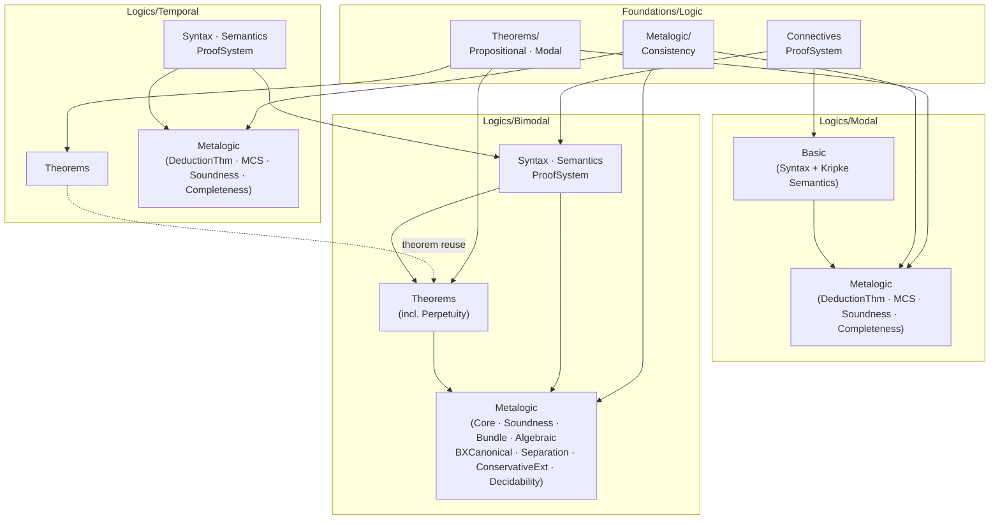

# Research Report: Task #45

**Task**: 45 - Improve ROADMAP.md diagram and structure
**Started**: 2026-06-09T00:00:00Z
**Completed**: 2026-06-09T00:30:00Z
**Effort**: 30 minutes
**Dependencies**: None
**Sources/Inputs**: specs/ROADMAP.md, Cslib/ source files (import statements), directory tree
**Artifacts**: specs/045_improve_roadmap_diagram_and_structure/reports/01_roadmap-improvement.md
**Standards**: report-format.md

---

## Executive Summary

- The current ROADMAP.md has three structural problems: an ASCII art "Import Hierarchy" section with embedded task numbers, a Phases section that is implementation history rather than orientation, and task references throughout the Completed/Remaining tables.
- The actual Cslib module dependency graph is: Foundations/Logic → Modal (parallel, independent of Temporal) and Foundations/Logic → Temporal (parallel, independent of Modal); both feed into Bimodal. Temporal Theorems does cross-import from Foundations (not from Modal), and Bimodal Theorems/Perpetuity does import from `Temporal.Theorems` — a nuance the current diagram omits.
- The recommended new structure: drop Phases, drop all task numbers, replace the ASCII diagram with a mermaid flowchart accurately showing the five-layer dependency structure, and add a focused file tree showing only `Cslib/Foundations/Logic/` and `Cslib/Logics/` (the logic library itself).

---

## Context & Scope

The ROADMAP.md currently lives at `specs/ROADMAP.md`. It describes the effort to port BimodalLogic content into CSLib. The task asks to:

1. Replace the Import Hierarchy ASCII block with an accurately labeled mermaid diagram.
2. Remove all task references throughout (readers should consult TODO.md).
3. Remove the Phases section entirely.
4. Add a file tree showing current project structure focused on the roadmap's aims.

---

## Findings

### 1. Current ROADMAP.md Structure Analysis

The file has five sections:

| Section | Lines | Issues |
|---------|-------|--------|
| Intro paragraph | 1–8 | References "Phases 1–3" — remove after Phases section is gone |
| Approach | 9–17 | Good prose; no task refs |
| Import Hierarchy (ASCII) | 18–35 | Task numbers in diagram labels; inaccurate layout (Modal metalogic shown parallel to Temporal but not connected to Bimodal Theorems) |
| Completed (table) | 37–57 | Task column with explicit task numbers (20, 21, 29, etc.) |
| Remaining (table) | 59–70 | Task column with task numbers (31, 35–41) |
| Phases | 72–102 | Entire section is implementation chronology, not orientation |

**Task references found** (to remove):
- Intro: "Phases 1–3"
- Import Hierarchy labels: "Task 20", "Tasks 21, 22", "Tasks 30, 23", "Task 31", "Tasks 2–11"
- Completed table: "Task" column with values 20, 21, 29, 22, 23, 30, 2, 3, 4, 5, 6, 7, 34, 10, 11, 42, 43
- Remaining table: "Task" column with values 31, 35–41
- Phases section: "Task 20", "Tasks 21, 22", "Task 23", "Tasks 29, 30", "Task 31", "Tasks 2–11", "Task 35", "Tasks 36, 37"

### 2. Actual Import/Dependency Relationships

The real module dependency structure was traced by reading `import` and `public import` statements across the source files. The five logical layers are:

**Layer 1 — Foundations (base)**
- `Cslib.Foundations.Logic.Connectives` — formula connective abstractions
- `Cslib.Foundations.Logic.ProofSystem` — abstract derivation relation typeclass
- `Cslib.Foundations.Logic.Theorems.Propositional.*` — generic propositional combinators
- `Cslib.Foundations.Logic.Theorems.Modal.*` — generic modal theorems (S4/S5)
- `Cslib.Foundations.Logic.Metalogic.Consistency` — SetConsistent, Lindenbaum (via Mathlib.Order.Zorn)

**Layer 2 — Modal (imports Layer 1 only)**
- `Cslib.Logics.Modal.Basic` — syntax, semantics (imports `Foundations.Logic.Connectives`, `Foundations.Data.Relation`)
- `Cslib.Logics.Modal.Metalogic.*` — DerivationTree imports `Foundations.Logic.Metalogic.Consistency`; DeductionTheorem, MCS, Soundness, Completeness build on that

**Layer 2 — Temporal (imports Layer 1 only, independent of Modal)**
- `Cslib.Logics.Temporal.Syntax.*` — Formula (no Cslib imports beyond Mathlib), Context, Subformulas
- `Cslib.Logics.Temporal.Semantics.*` — Model imports `Temporal.Syntax.Formula`; Satisfies → Model; Validity → Satisfies
- `Cslib.Logics.Temporal.ProofSystem.*` — Axioms/Derivation/Derivable/Instances (Instances imports `Foundations.Logic.ProofSystem`)
- `Cslib.Logics.Temporal.Theorems.*` — TemporalDerived imports `Foundations.Logic.Theorems.Propositional.*`; FrameConditions from Mathlib only
- `Cslib.Logics.Temporal.Metalogic.*` — DerivationTree imports `Foundations.Logic.Metalogic.Consistency` + `Temporal.ProofSystem.Derivation`; Soundness imports `Temporal.Semantics.Validity`; all metalogic stays within Temporal

**Layer 3 — Bimodal (imports Layers 1 and 2)**
- `Cslib.Logics.Bimodal.Syntax.*` — Formula imports `Foundations.Logic.Connectives`; Context → Formula
- `Cslib.Logics.Bimodal.Semantics.*` — TaskFrame/WorldHistory/TaskModel/Truth/Validity (no cross-logic imports; TaskFrame only uses Mathlib)
- `Cslib.Logics.Bimodal.ProofSystem.*` — imports `Bimodal.Syntax.*` and `Foundations.Logic.ProofSystem`
- `Cslib.Logics.Bimodal.Theorems.*` — **Note**: `Perpetuity.Principles` imports `Cslib.Logics.Temporal.Theorems.TemporalDerived` — this is the only Bimodal→Temporal cross-import; also imports `Foundations.Logic.Theorems.Modal.S5`
- `Cslib.Logics.Bimodal.FrameConditions.*` — imports `Bimodal.Semantics.*`, `Bimodal.ProofSystem.*`, `Bimodal.Metalogic.Soundness.*`
- `Cslib.Logics.Bimodal.Metalogic.Core.*` — DerivationTree imports `Foundations.Logic.Metalogic.Consistency` + `Bimodal.ProofSystem.Derivation`
- `Cslib.Logics.Bimodal.Metalogic.Bundle.*` — builds on `Core.*`, `Bimodal.Theorems.*`, `Bimodal.Syntax.*`
- `Cslib.Logics.Bimodal.Metalogic.Algebraic.*` — builds on `Bundle.*`, `Core.*`, `Bimodal.Semantics.*`
- `Cslib.Logics.Bimodal.Metalogic.BXCanonical.*` — builds on `Bundle.*`, `Core.*`, `Bimodal.Semantics.*`
- `Cslib.Logics.Bimodal.Metalogic.Soundness.*` — imports `Bimodal.ProofSystem.*`, `Bimodal.Semantics.*`
- `Cslib.Logics.Bimodal.Metalogic.Separation.*` — within `Bimodal.Metalogic`
- `Cslib.Logics.Bimodal.Metalogic.ConservativeExtension.*` — within `Bimodal.Metalogic` + `Bimodal.ProofSystem.*`
- `Cslib.Logics.Bimodal.Metalogic.Decidability.*` — imports `Bimodal.Metalogic.Core.*`, `Bimodal.ProofSystem.*`, `Bimodal.Semantics.*`
- `Cslib.Logics.Bimodal.Embedding.*` — (no Cslib imports from outside Bimodal found)

**Key findings vs. current diagram:**
1. The current diagram implies Modal Metalogic and Temporal are fully parallel and equal peers. This is accurate at the layer level.
2. The diagram is missing the edge: `Temporal.Theorems → Foundations.Logic.Theorems.Propositional` (it's just within Foundations), and `Bimodal.Theorems.Perpetuity → Temporal.Theorems`.
3. The "Bimodal" box in the diagram should be more detailed — it bundles Syntax/Semantics/ProofSystem/Theorems/Metalogic into one box, which loses the sub-structure.
4. The diagram correctly shows Bimodal does NOT import from Modal or Temporal metalogic — confirmed by grep.

**Corrected dependency summary for mermaid diagram:**

```
Foundations/Logic/
  ├── Connectives, ProofSystem    ← base infrastructure
  ├── Theorems/Propositional/     ← used by Modal, Temporal.Theorems, Bimodal.Theorems
  ├── Theorems/Modal/             ← used by Bimodal.Theorems.Perpetuity
  └── Metalogic/Consistency       ← used by Modal.Metalogic, Temporal.Metalogic, Bimodal.Metalogic.Core

Modal/
  ├── Basic (Syntax+Semantics)    ← imports Foundations
  └── Metalogic/                  ← imports Foundations.Logic.Metalogic, Modal.Basic

Temporal/
  ├── Syntax/                     ← no Cslib imports (only Mathlib)
  ├── Semantics/                  ← imports Temporal.Syntax
  ├── ProofSystem/                ← imports Temporal.Syntax, Foundations.Logic.ProofSystem
  ├── Theorems/                   ← imports Foundations.Logic.Theorems.Propositional
  └── Metalogic/                  ← imports Foundations.Logic.Metalogic, Temporal.ProofSystem, Temporal.Semantics

Bimodal/
  ├── Syntax/                     ← imports Foundations.Logic.Connectives
  ├── Semantics/                  ← imports Bimodal.Syntax (TaskFrame is standalone)
  ├── ProofSystem/                ← imports Bimodal.Syntax, Foundations.Logic.ProofSystem
  ├── Theorems/                   ← imports Bimodal.ProofSystem, Bimodal.Syntax
  │   └── Perpetuity/             ← ALSO imports Temporal.Theorems, Foundations.Logic.Theorems.Modal
  └── Metalogic/                  ← imports Bimodal.Syntax/Semantics/ProofSystem/Theorems, Foundations.Logic.Metalogic
```

**Note on Temporal ↔ Bimodal**: Bimodal does NOT import from Temporal Metalogic or Temporal Semantics. The only cross-import is `Bimodal.Theorems.Perpetuity.Principles → Temporal.Theorems.TemporalDerived`. This is a theorem-reuse dependency (shared proof steps), not a metalogic dependency.

### 3. Current File Tree of Cslib/ (Logic-relevant subset)

The full Cslib directory has many non-logic modules (Computability, Crypto, Algorithms, MachineLearning, Probability, Languages, etc.) that are not part of the roadmap's aims. The roadmap's scope is `Cslib/Foundations/Logic/` and `Cslib/Logics/`.

```
Cslib/
├── Foundations/
│   └── Logic/
│       ├── Connectives.lean
│       ├── ProofSystem.lean
│       ├── InferenceSystem.lean
│       ├── LogicalEquivalence.lean
│       ├── Axioms.lean
│       ├── Theorems.lean             (umbrella re-export)
│       ├── Theorems/
│       │   ├── Propositional/
│       │   │   ├── Core.lean
│       │   │   ├── Connectives.lean
│       │   │   └── Reasoning.lean
│       │   ├── Modal/
│       │   │   ├── Basic.lean
│       │   │   └── S5.lean
│       │   ├── BigConj.lean
│       │   └── Combinators.lean
│       └── Metalogic/
│           └── Consistency.lean
├── Logics/
│   ├── Modal/
│   │   ├── Basic.lean               (syntax + Kripke semantics)
│   │   ├── Cube.lean
│   │   ├── Denotation.lean
│   │   ├── Metalogic.lean           (umbrella re-export)
│   │   └── Metalogic/
│   │       ├── DerivationTree.lean
│   │       ├── DeductionTheorem.lean
│   │       ├── MCS.lean
│   │       ├── Soundness.lean
│   │       └── Completeness.lean
│   ├── Temporal/
│   │   ├── Syntax/
│   │   │   ├── Formula.lean
│   │   │   ├── Context.lean
│   │   │   ├── BigConj.lean
│   │   │   └── Subformulas.lean
│   │   ├── Semantics/
│   │   │   ├── Model.lean
│   │   │   ├── Satisfies.lean
│   │   │   └── Validity.lean
│   │   ├── ProofSystem.lean         (umbrella re-export)
│   │   ├── ProofSystem/
│   │   │   ├── Axioms.lean
│   │   │   ├── Derivation.lean
│   │   │   ├── Derivable.lean
│   │   │   └── Instances.lean
│   │   ├── Theorems.lean            (umbrella re-export)
│   │   ├── Theorems/
│   │   │   ├── TemporalDerived.lean
│   │   │   └── FrameConditions.lean
│   │   ├── Metalogic.lean           (umbrella re-export)
│   │   └── Metalogic/
│   │       ├── DerivationTree.lean
│   │       ├── DeductionTheorem.lean
│   │       ├── MCS.lean
│   │       ├── Soundness.lean
│   │       └── Completeness.lean
│   └── Bimodal/
│       ├── Syntax/
│       │   ├── Formula.lean
│       │   ├── Context.lean
│       │   ├── Subformulas.lean
│       │   └── SubformulaClosure/
│       ├── Semantics/
│       │   ├── TaskFrame.lean
│       │   ├── WorldHistory.lean
│       │   ├── TaskModel.lean
│       │   ├── Truth.lean
│       │   └── Validity.lean
│       ├── ProofSystem/
│       │   ├── Axioms.lean
│       │   ├── Derivation.lean
│       │   ├── Derivable.lean
│       │   ├── Instances.lean
│       │   ├── LinearityDerivedFacts.lean
│       │   └── Substitution.lean
│       ├── Theorems/
│       │   ├── Combinators.lean
│       │   ├── GeneralizedNecessitation.lean
│       │   ├── TemporalDerived.lean
│       │   ├── Propositional/
│       │   └── Perpetuity/
│       ├── FrameConditions/
│       │   ├── FrameClass.lean
│       │   ├── Validity.lean
│       │   ├── Soundness.lean
│       │   └── Compatibility.lean
│       ├── Embedding/
│       │   ├── PropositionalEmbedding.lean
│       │   ├── ModalEmbedding.lean
│       │   └── TemporalEmbedding.lean
│       └── Metalogic/
│           ├── Core.lean            (umbrella re-export)
│           ├── Core/
│           │   ├── DerivationTree.lean
│           │   ├── DeductionTheorem.lean
│           │   ├── MaximalConsistent.lean
│           │   ├── MCSProperties.lean
│           │   └── RestrictedMCS.lean
│           ├── Soundness/
│           ├── Bundle/
│           ├── Algebraic/
│           ├── BXCanonical/         (in progress: dense completeness)
│           ├── Separation/
│           ├── ConservativeExtension/
│           ├── Decidability/
│           │   └── FMP/
│           └── Completeness.lean
```

### 4. Exists vs. Planned

**Currently exists** (all files above are present):
- All of `Foundations/Logic/`
- All of `Logics/Modal/`
- All of `Logics/Temporal/` (including Metalogic — task 31 is complete)
- All of `Logics/Bimodal/` listed above, including BXCanonical (task 35 in progress — files exist but some proofs incomplete)

**Planned / not yet started:**
- Discrete completeness: `Logics/Bimodal/Metalogic/` — new files within existing directory
- Continuous extension completeness: `Logics/Bimodal/Metalogic/` — new files
- Dense temporal completeness: `Logics/Temporal/Metalogic/` — new files (task 38)
- Discrete temporal completeness: `Logics/Temporal/Metalogic/` — new files (task 39)
- Continuous temporal completeness: `Logics/Temporal/Metalogic/` — new files (task 40)
- Abstract shared completeness infrastructure: new files in both `Bimodal/Metalogic/` and `Temporal/Metalogic/` (task 41)

---

## Decisions

1. **Drop the Task column from Completed and Remaining tables.** Replace with a "Status" column (Complete / In Progress) if needed, or simply omit status entirely since section title makes it clear.

2. **Replace the Import Hierarchy ASCII block with a mermaid flowchart.** The mermaid diagram should show the five subsystem boxes and the actual dependency edges — importantly including the `Bimodal.Theorems.Perpetuity → Temporal.Theorems` edge, which the current diagram omits.

3. **Remove Phases section entirely.** The Approach section already gives the conceptual order; the Phases section is implementation history that belongs in TODO.md or git log.

4. **Update intro paragraph.** Remove the "Phases 1–3 are complete, self-contained deliverables" sentence since Phases section is being deleted. Rewrite to orient the reader by logical dependency rather than phase number.

5. **Add a file tree section.** Show only `Cslib/Foundations/Logic/` and `Cslib/Logics/` (not the full Cslib tree, which includes Computability, Crypto, etc.). Use a focused tree that represents current state.

---

## Risks & Mitigations

- **Mermaid diagram complexity**: The Bimodal Metalogic layer has many sub-components (Core, Bundle, Algebraic, BXCanonical, Soundness, Separation, ConservativeExtension, Decidability). Showing every sub-module makes the diagram unreadable. Mitigation: keep the mermaid diagram at "subsystem" granularity (Foundations, Modal, Temporal.ProofSystem+Theorems, Temporal.Metalogic, Bimodal.Syntax+Semantics+ProofSystem, Bimodal.Theorems, Bimodal.Metalogic) rather than file level. The file tree section can show file-level detail.

- **Temporal.Theorems → Foundations dependency**: The cross-link from `Bimodal.Theorems.Perpetuity` to `Temporal.Theorems` may surprise readers since the diagram otherwise shows Bimodal only depending on Foundations. Mitigation: annotate this edge in the mermaid diagram with a note like `(theorem reuse)` or show it as a dashed edge.

---

## Recommendations for Improved ROADMAP.md Structure

### Proposed Section Order

```
# Project Roadmap: CSLib Logic Modules

[Intro — 2-3 sentences, no phase references]

## Approach

[Existing prose, unchanged]

## Module Dependency Structure

[Mermaid flowchart — see below]

## File Tree

[Focused tree showing Foundations/Logic/ and Logics/]

## Completed

[Table without Task column: Component | Module]

## Remaining

[Table without Task column: Component | Module]
```

### Proposed Mermaid Diagram



### Notes on Completed/Remaining Tables

Remove the "Task" column entirely. Keep "Component" and "Module" columns. For the Remaining table, a "Status" column (Planned / In Progress) is optional but useful.

---

## Context Extension Recommendations

- **Topic**: ROADMAP.md maintenance conventions
- **Gap**: No documented convention for keeping ROADMAP.md task-reference-free
- **Recommendation**: Add a one-line note in ROADMAP.md header or in `.claude/context/repo/project-overview.md` that task numbers live only in TODO.md, not ROADMAP.md.

---

## Appendix

### Search Queries Used
- `grep -r "^import\|^public import"` across `Cslib/Foundations/Logic/`, `Cslib/Logics/Modal/`, `Cslib/Logics/Temporal/`, `Cslib/Logics/Bimodal/`
- `grep -r "^import Cslib.Logics.Temporal" Cslib/Logics/Bimodal/` — confirmed single cross-import
- `grep -r "^import Cslib.Logics.Modal" Cslib/Logics/Bimodal/` — confirmed no Modal imports in Bimodal
- `find Cslib -type d | sort` — for complete directory tree
- `find Cslib -type f -name "*.lean" | sort` — for complete file list

### References
- `specs/ROADMAP.md` — current roadmap (lines 1–102)
- Import traces: all `.lean` files in `Cslib/Foundations/Logic/` and `Cslib/Logics/`
