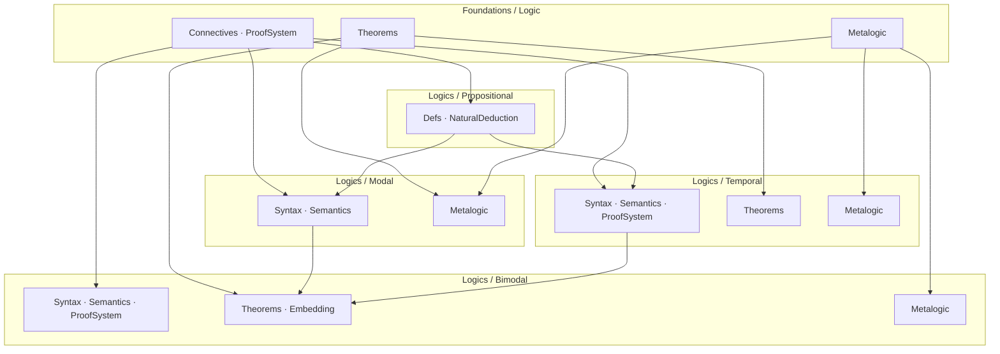

# Project Roadmap: Porting BimodalLogic to CSLib

This document describes the ongoing effort to extract and organize content from
the [BimodalLogic](https://github.com/benbrastmckie/BimodalLogic) repository
into four standalone CSLib modules: **Foundations/Logic**, **Modal**, **Temporal**,
and **Bimodal**. See `specs/TODO.md` for task tracking.

## Approach

Every component lives at the most general level it can compile at. Content is
distributed across five module levels — Foundations/Logic/, Logics/Propositional/,
Logics/Modal/, Logics/Temporal/, and Logics/Bimodal/. Foundations provides
shared infrastructure (connectives, proof systems, propositional theorems, MCS
theory). Propositional defines the base formula type and imports only from
Foundations. Modal and Temporal each import from both Foundations and
Propositional, establishing Propositional as a shared sub-logic. Bimodal
imports from all three peer modules and from Foundations directly.

## Module Dependency Structure

Imports flow downward through four layers: Foundations at top,
Propositional as the shared sub-logic, Modal and Temporal as
independent peers (both importing from Propositional), and Bimodal
at the bottom.



## Completed

| Component | Module |
|-----------|--------|
| Propositional Hilbert theorems (combinators, core, weakening, cut, big-conjunction) | `Foundations/Logic/Theorems/` |
| Modal proof system, S4/S5 theorems, GeneralizedNecessitation | `Foundations/Logic/Theorems/Modal/` |
| Generic MCS foundations (SetConsistent, SetMaximalConsistent, Lindenbaum) | `Foundations/Logic/Metalogic/` |
| Temporal proof system (26-axiom BX), derived theorems, frame conditions | `Logics/Temporal/ProofSystem/` + `Logics/Temporal/Theorems/` |
| Temporal semantics on LinearOrder | `Logics/Temporal/Semantics/` |
| Modal metalogic: DeductionTheorem, MCS, Soundness, Completeness | `Logics/Modal/Metalogic/` |
| Bimodal syntax: Context, BigConj, Subformulas | `Logics/Bimodal/Syntax/` |
| Task frame semantics: TaskFrame, WorldHistory, Truth, Validity | `Logics/Bimodal/Semantics/` |
| Bimodal proof system: 42-axiom Hilbert, DerivationTree, Substitution | `Logics/Bimodal/ProofSystem/` |
| Perpetuity theorems (bimodal fixed-point principles) | `Logics/Bimodal/Theorems/Perpetuity/` |
| Frame conditions + Soundness | `Logics/Bimodal/FrameConditions/` + `Logics/Bimodal/Metalogic/Soundness/` |
| Bimodal DeductionTheorem + MCS theory | `Logics/Bimodal/Metalogic/Core/` |
| Base MCS completeness properties | `Logics/Bimodal/Metalogic/` |
| Separation theorem (GHR94 10.2.9) | `Logics/Bimodal/Metalogic/Separation/` |
| BX conservative extension | `Logics/Bimodal/Metalogic/ConservativeExtension/` |
| Tableau decision procedure | `Logics/Bimodal/Metalogic/Decidability/` |
| Finite model property | `Logics/Bimodal/Metalogic/Decidability/FMP/` |
| Dense completeness (Algebraic, Bundle, BXCanonical) | `Logics/Bimodal/Metalogic/` |
| Temporal metalogic: DeductionTheorem, MCS, Soundness, Completeness | `Logics/Temporal/Metalogic/` |
| Temporal syntax infrastructure (Context, BigConj, Subformulas) | `Logics/Temporal/Syntax/` |
| Temporal chronicle completeness pipeline (R-relation, canonical chain, point insertion, chronicle construction, truth lemma) | `Logics/Temporal/Metalogic/Chronicle/` |
| Bimodal embedding (PropositionalEmbedding, ModalEmbedding, TemporalEmbedding) | `Logics/Bimodal/Embedding/` |

## Remaining

| Component | Module |
|-----------|--------|
| Discrete completeness | `Logics/Bimodal/Metalogic/` |
| Continuous extension completeness | `Logics/Bimodal/Metalogic/` |
| Dense temporal completeness | `Logics/Temporal/Metalogic/` |
| Discrete temporal completeness | `Logics/Temporal/Metalogic/` |
| Continuous temporal completeness | `Logics/Temporal/Metalogic/` |
| Abstract shared completeness infrastructure | `Logics/Bimodal/Metalogic/` + `Logics/Temporal/Metalogic/` |

## Project Structure

The logic library lives in two directory trees within `Cslib/`:

```
Cslib/
├── Foundations/
│   └── Logic/
│       ├── Connectives.lean
│       ├── ProofSystem.lean
│       ├── InferenceSystem.lean
│       ├── LogicalEquivalence.lean
│       ├── Axioms.lean
│       ├── Theorems.lean
│       ├── Theorems/
│       │   ├── Propositional/
│       │   │   ├── Core.lean
│       │   │   ├── Connectives.lean
│       │   │   └── Reasoning.lean
│       │   ├── Modal/
│       │   │   ├── Basic.lean
│       │   │   └── S5.lean
│       │   ├── BigConj.lean
│       │   └── Combinators.lean
│       └── Metalogic/
│           └── Consistency.lean
└── Logics/
    ├── Modal/
    │   ├── Basic.lean
    │   ├── Cube.lean
    │   ├── Denotation.lean
    │   ├── Metalogic.lean
    │   └── Metalogic/
    │       ├── DerivationTree.lean
    │       ├── DeductionTheorem.lean
    │       ├── MCS.lean
    │       ├── Soundness.lean
    │       └── Completeness.lean
    ├── Temporal/
    │   ├── Syntax/
    │   │   ├── Formula.lean
    │   │   ├── Context.lean
    │   │   ├── BigConj.lean
    │   │   └── Subformulas.lean
    │   ├── Semantics/
    │   │   ├── Model.lean
    │   │   ├── Satisfies.lean
    │   │   └── Validity.lean
    │   ├── ProofSystem.lean
    │   ├── ProofSystem/
    │   │   ├── Axioms.lean
    │   │   ├── Derivation.lean
    │   │   ├── Derivable.lean
    │   │   └── Instances.lean
    │   ├── Theorems.lean
    │   ├── Theorems/
    │   │   ├── TemporalDerived.lean
    │   │   └── FrameConditions.lean
    │   ├── Metalogic.lean
    │   └── Metalogic/
    │       ├── DerivationTree.lean
    │       ├── DeductionTheorem.lean
    │       ├── MCS.lean
    │       ├── Soundness.lean
    │       ├── Completeness.lean
    │       ├── TemporalContent.lean
    │       ├── WitnessSeed.lean
    │       ├── PropositionalHelpers.lean
    │       ├── GeneralizedNecessitation.lean
    │       ├── CompletenessHelpers.lean
    │       └── Chronicle/
    │           ├── ChronicleTypes.lean
    │           ├── RRelation.lean
    │           ├── Frame.lean
    │           ├── CanonicalChain.lean
    │           ├── OrderedSeedConsistency.lean
    │           ├── PointInsertion.lean
    │           ├── ChronicleConstruction.lean
    │           ├── CounterexampleElimination.lean
    │           ├── TruthLemma.lean
    │           └── ChronicleToCountermodel.lean
    └── Bimodal/
        ├── Syntax/
        │   ├── Formula.lean
        │   ├── Context.lean
        │   ├── Subformulas.lean
        │   ├── SubformulaClosure.lean
        │   └── SubformulaClosure/
        ├── Semantics/
        │   ├── TaskFrame.lean
        │   ├── WorldHistory.lean
        │   ├── TaskModel.lean
        │   ├── Truth.lean
        │   └── Validity.lean
        ├── ProofSystem/
        │   ├── Axioms.lean
        │   ├── Derivation.lean
        │   ├── Derivable.lean
        │   ├── Instances.lean
        │   ├── LinearityDerivedFacts.lean
        │   └── Substitution.lean
        ├── Theorems/
        │   ├── Combinators.lean
        │   ├── GeneralizedNecessitation.lean
        │   ├── TemporalDerived.lean
        │   ├── Propositional/
        │   └── Perpetuity/
        ├── FrameConditions/
        ├── Embedding/
        │   ├── PropositionalEmbedding.lean
        │   ├── ModalEmbedding.lean
        │   └── TemporalEmbedding.lean
        └── Metalogic/
            ├── Core.lean
            ├── Core/
            ├── Soundness/
            ├── Bundle/
            ├── Algebraic/
            ├── BXCanonical/
            ├── Separation/
            ├── ConservativeExtension/
            ├── Decidability/
            │   └── FMP/
            └── Completeness.lean
```
